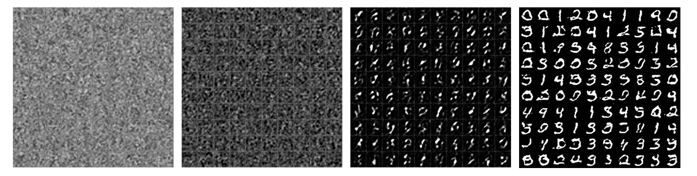
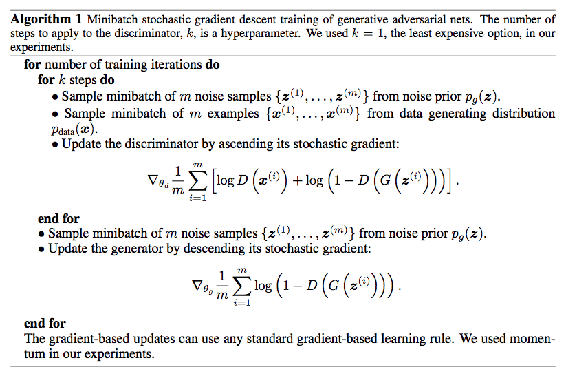

# Generative Adversarial Nets (GANs) - Generating Images from Custom Datasets
**[Original Paper [1]](https://arxiv.org/pdf/1406.2661.pdf)**


***"Can you look at a painting and recognize it as being the Mona Lisa? You probably can. That's discriminative modeling. 
Can you paint the Mona Lisa yourself? You probably can't. That's generative modeling."***
- Ian Goodfellow, Inventor of GANs


## Introduction
With this project it is possible not only to generate numbers when trained on the in Keras integrated MNIST dataset, 



but also to use any custom set of images. A dataset of faces or even pokemon sprites can be used to generate new Pokomon or portraits. For example, after testing the model on MNIST, I used images of forrests and retrained the net to create new sceneries.

## Setup
Download the project and create a virtual environment if necessary. Following depencies need to be installed:

- `tensorflow`
- `numpy`


## Run
...hot to run the program in terminal when setup

----

**Notes:**

Because of copyright issues and also since it would use a lot of space, I can not show the files in the `raw_picture_downloads` folder. In order to understand how I got this custom set of images open `prep.ipynb`. The scraped images (which would be in the `raw_picture_downloads` folder) were reformated to 128x128 pixel images. 

The scaled images are used to train the GAN and generate new (hopefully) similar images.

## How it works

### Preprocessing the Data

After scraping google for images, downloading them to `/raw_picture_downloads` (see ["How to scrape imags from Google"](http://stackoverflow.com/questions/20716842/python-download-images-from-google-image-search)) their resultion is way to high! After thinking to crop the images or splitting them into smaller images, I decided to just scale them down. If you want to learn more about manipulating images and processing data read [here](http://www.scipy-lectures.org/advanced/image_processing/). 

**When using Keras it is actually way simpler to just use the Keras Processing Module as shown after this, since reformating the images into the right uint8 array can be nervewrecking.**


If we run this, the scraped google images will be stretched. In this particular case I made sure only to select pictures which already have near to equal sides, so this isn't much of a problem here.


```python
r_format('data/raw_picture_downloads',
         'data/scaled_pictures' )
```

---
The data pipeline can be simplified drasticly via the keras.preprocessing library. For example, our reformating step with `r_format()` is already done by defining the target_size inside `flow_from_directory()`. The goal simply is to have all the downscaled images transformed into a single *uint8* array, similar to the [CIFAR dataset](https://keras.io/datasets/) that comes with Keras. It is in color, rgb with the shape (num_samples, dim(rgb), SIZE, SIZE) = (65, 3, 128, 128). Additionally the dataset will be augmented/extended by rotating, flipping the images etc. in several ways. The result will be the `train_batch`:


```python
from keras.preprocessing.image import ImageDataGenerator

# augment and iterate through the dataset
train_batch = ImageDataGenerator(
    rotation_range=10,
    width_shift_range=0.1,
    height_shift_range=0.1,
    shear_range=0.15,
    zoom_range=0.1,
    horizontal_flip=True)

# define the training batch
train_batch = train_batch.flow_from_directory(
    'data',
    target_size=(28, 28),
    color_mode="rgb",
    class_mode="input",
    batch_size=5,
    shuffle=True,
    seed=42)
```

    /Users/q/tensorflow/lib/python2.7/site-packages/h5py/__init__.py:36: FutureWarning: Conversion of the second argument of issubdtype from `float` to `np.floating` is deprecated. In future, it will be treated as `np.float64 == np.dtype(float).type`.
      from ._conv import register_converters as _register_converters
    Using TensorFlow backend.


    Found 103 images belonging to 2 classes.


```python
train_batch = next(train_batch)
```

### The Model
Lorem ipsum dolor sit amet, consetetur sadipscing elitr, sed diam nonumy eirmod tempor invidunt ut labore et dolore magna aliquyam erat, sed diam voluptua. At vero eos et accusam et justo duo dolores et ea rebum. Stet clita kasd gubergren, no sea takimata sanctus est Lorem ipsum dolor sit amet. Lorem ipsum dolor sit amet, consetetur sadipscing elitr, sed diam nonumy eirmod tempor invidunt ut labore et dolore magna aliquyam erat, sed diam voluptua. At vero eos et accusam et justo duo dolores et ea rebum. Stet clita kasd gubergren, no sea takimata sanctus est Lorem ipsum dolor sit amet.

```python
	
	
	
	
	
	
	
	
	
	
	
	
	
	
	
```

### Train
Lorem ipsum dolor sit amet, consetetur sadipscing elitr, sed diam nonumy eirmod tempor invidunt ut labore et dolore magna aliquyam erat, sed diam voluptua. At vero eos et accusam et justo duo dolores et ea rebum. Stet clita kasd gubergren, no sea takimata sanctus est Lorem ipsum dolor sit amet. Lorem ipsum dolor sit amet, consetetur sadipscing elitr, sed diam nonumy eirmod tempor invidunt ut labore et dolore magna aliquyam erat, sed diam voluptua. At vero eos et accusam et justo duo dolores et ea rebum. Stet clita kasd gubergren, no sea takimata sanctus est Lorem ipsum dolor sit amet.



Lorem ipsum dolor sit amet, consetetur sadipscing elitr, sed diam nonumy eirmod tempor invidunt ut labore et dolore magna aliquyam erat, sed diam voluptua. At vero eos et accusam et justo duo dolores et ea rebum. 

```python
	
	
	
	
	
	
	
	
	
	
	
	
	
```
Stet clita kasd gubergren, no sea takimata sanctus est Lorem ipsum dolor sit amet. Lorem ipsum dolor sit amet, consetetur sadipscing elitr, sed diam nonumy eirmod tempor invidunt ut labore et dolore magna aliquyam erat, sed diam voluptua. At vero eos et accusam et justo duo dolores et ea rebum. Stet clita kasd gubergren, no sea takimata sanctus est Lorem ipsum dolor sit amet.

### Generate
Stet clita kasd gubergren, no sea takimata sanctus est Lorem ipsum dolor sit amet. Lorem ipsum dolor sit amet, consetetur sadipscing elitr, sed diam nonumy eirmod tempor invidunt ut labore et dolore magna aliquyam erat, sed diam voluptua. At vero eos et accusam et justo duo dolores et ea rebum. The model can be trained by:

```python
GAN().train(epochs=13, batch_size=5, k=1, save_interval=5)
```

I did so fortwo hours on my CPU with the MNIST dataset. With


```python
GAN().generate(sample_size=100)
```

new images based on the dataset are generated! It works! !


## Notes


I ran it out of curiosity for two hours on a CPU. Don't do that unless you like wasting your time.

While training, the samples show that the biggest impact of the network is beeing made by the smallest layers of the Generator, as one expects. When the optimal weights for the smallest/first layer are found the next layers change has the most impact on the results. This can be seen by the type of changes in the rendered samples. The smaller/earlier the layer in the generator, the more macroscopic the change in the results. Small changes have great power of the results. Yet higher layers change the ouptput in more detail. They are controlled by the preceding layers. When their time comes, meaning, when the earlier layers are well optimized, this layer will create sharp and small artifacts. When it is optimized at last the result will be a macroscopic coherend picture of numer sharply rendered.

What we can learn from this is that it makes sense to simply train on layer after another instead of training them all together. After one small layer is trained, a bigger layer gets layed over it and trained and so on. This way the model will converge way faster since the number of weights that have to be changed through backpropagation is way smaller.

**In progress:**

+ Improve formating custom image data (CID)
+ Improve augmentation of the CID
+ Improve model

I am thinking a lot about growing multilayer perceptrons. I will explore this idea in the future.


## References

**Please read the original paper [Generative Adversarial Nets, Ian J. Goodfellow (ArXiv)](https://arxiv.org/pdf/1406.2661.pdf). It is very well written and still the best introduction I could find. You may also want to check out this collection of other [resources and implementations](https://github.com/YadiraF/GAN) on GitHub.**

It may be redundant, but if you want to see some inspiring variations of GANs newer papers and resources to dive deeper into the topic:

+ [GAN in Tensorflow, GitHub] (https://wiseodd.github.io/techblog/2016/09/17/gan-tensorflow/)
+ [Generative Models, OpenAI] (https://blog.openai.com/generative-models/#contributions)
+ [Plug & Play Generative Networks, Anh Nguyen (ArXiv)](https://arxiv.org/pdf/1612.00005.pdf)
+ [Progressivly Growing GAN, NVIDIA (ArXiv)](https://arxiv.org/abs/1710.10196)
+ [Unsupervised Representation Learning with DCGANs, Alec Radford & Luke Metz (ArXiv)](https://arxiv.org/pdf/1511.06434.pdf)
+ [Computerfile on GANs, YouTube](https://www.youtube.com/watch?v=Sw9r8CL98N0)
+ [Siraj Raval on GANs](https://www.youtube.com/watch?v=PhCM3qoRZHE)
+ [Siraj Raval on generating Pokemons with GANs, YouTube](https://www.youtube.com/watch?v=yz6dNf7X7SA)
+ [NVIDIA generating Faces, YouTube](https://www.youtube.com/watch?v=G06dEcZ-QTg&feature=youtu.be)
+ [DeepLearning4You on GANs, Blog](https://deeplearning4j.org/generative-adversarial-network)
+ [From GANs to Wasserstein GANs, GitHub](https://lilianweng.github.io/lil-log/2017/08/20/from-GAN-to-WGAN.html)
+ [Unified GAN in Tensorflow, GitHub](https://github.com/lilianweng/unified-gan-tensorflow)
+ [DCGAN in Tensorflow, GitHub](https://github.com/carpedm20/DCGAN-tensorflow)


**Thank You!** -  You can write me on Twitter [@Quentin_Quinten](https://twitter.com/Quentin_Quinten) if you have any questions, suggestions or want to chat.